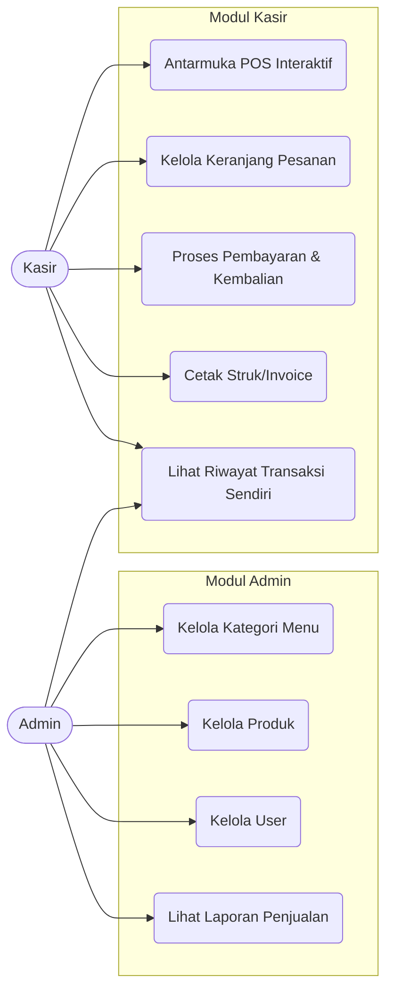
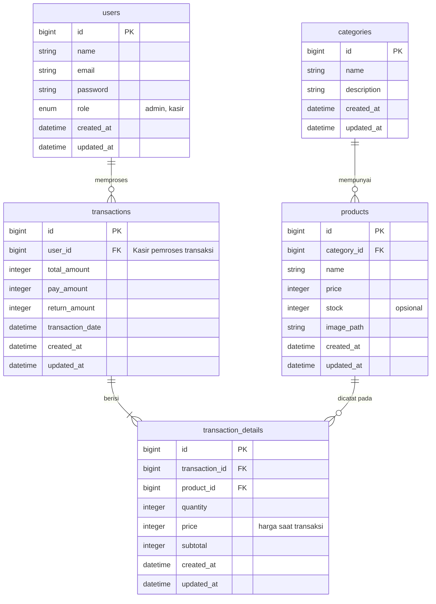

# POS (Point of Sale) Café

Sistem kasir digital berbasis web menggunakan Laravel 12 dan MySQL. Proyek ini memfasilitasi transaksi POS, pencatatan pendapatan harian, dan manajemen menu serta kasir oleh admin, menggantikan pencatatan manual di balai/cafe.

## Tahap 1: Perencanaan & Desain Database

### 1. Aktor dan Use Case Sistem

Sistem ini memiliki dua role utama dengan batasan otorisasi akses:

- **Admin**: Memiliki akses penuh (Master Data dan Laporan).
- **Kasir**: Akses terbatas pada modul Transaksi POS dan Riwayat Transaksi kasir tersebut.

### 2. Entity Relationship Diagram (ERD)

Skema database dirancang untuk mendukung manajemen menu dan relasional transaksi POS.

## Tahap 2 & Tahap 3
(Dalam proses implementasi codebase)
