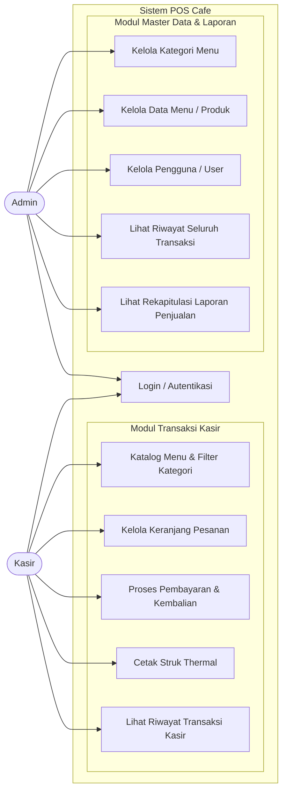
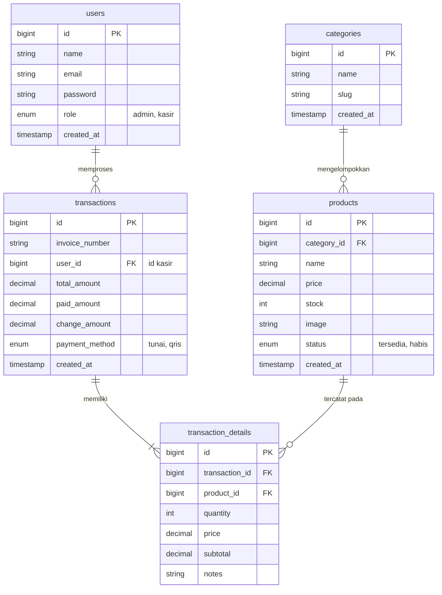

# POS (Point of Sale) Cafe - Kopi Senja

Aplikasi kasir kedai kopi berbasis web menggunakan Laravel 12, TailwindCSS, dan MySQL. Sistem ini dirancang untuk memproses transaksi kasir secara cepat dan akurat, perhitungan uang kembalian otomatis, cetak struk thermal, serta rekapitulasi laporan pendapatan harian bagi pemilik cafe.

---

## Tahap 1: Perencanaan & Desain Database

### 1. Aktor dan Use Case Diagram

Sistem memiliki dua peran aktor utama dengan batasan hak akses:
- **Admin**: Akses penuh ke seluruh sistem mencakup Master Data (Kategori, Produk, User) dan Laporan Penjualan/Omzet.
- **Kasir**: Akses terbatas pada modul Transaksi POS, Cetak Struk, dan Riwayat Transaksi kasir tersebut.



---

### 2. Entity Relationship Diagram (ERD)

Rancangan tabel MySQL berelasi untuk mendukung operasional pemesanan kasir dan rekap omzet:



---

## Struktur Modul Aplikasi

### 1. Modul Kasir (POS Cashier) - `/pos`
- Tampilan katalog menu interaktif dengan filter kategori instan.
- Keranjang belanja dinamis (tambah, kurang quantity, hapus item, catatan kustom).
- Perhitungan subtotal, pajak restoran (10%), dan total akhir secara real-time.
- Modal pembayaran tunai dengan tombol uang pas dan nominal cepat (Rp 20.000, Rp 50.000, Rp 100.000).
- Dukungan metode non-tunai (QRIS) dan kalkulasi otomatis uang kembalian.
- Pratinjau struk dan cetak format thermal printer 58mm/80mm (`window.print()`).
- Halaman riwayat transaksi kasir bersangkutan (`/pos/history`) beserta fitur cetak ulang struk.

### 2. Modul Admin & Master Data - `/admin`
- **Dashboard (`/admin/dashboard`):** Ringkasan omzet hari ini, jumlah transaksi, nilai rata-rata keranjang, dan daftar produk terlaris.
- **Kategori (`/admin/categories`):** CRUD kategori menu cafe.
- **Produk (`/admin/products`):** CRUD produk beserta gambar, harga jual, dan kontrol stok.
- **Pengguna (`/admin/users`):** Manajemen akun kasir dan hak akses administrator.
- **Laporan (`/admin/reports`):** Rekapitulasi pendapatan kotor harian dan bulanan dengan pemisahan pemasukan Tunai dan QRIS.

---

## Panduan Menjalankan Sistem

### Persyaratan Sistem
- PHP >= 8.2
- Composer
- Node.js & NPM
- MySQL Server

### Langkah Menjalankan Aplikasi
1. Clone repositori:
   ```bash
   git clone https://github.com/yanzyuyu/pos-tugas.git
   cd pos-tugas
   ```

2. Install dependensi backend & frontend:
   ```bash
   composer install
   npm install
   ```

3. Konfigurasi environment:
   ```bash
   cp .env.example .env
   php artisan key:generate
   ```

4. Build aset frontend:
   ```bash
   npm run build
   ```

5. Jalankan server lokal:
   ```bash
   php artisan serve
   ```
   Akses aplikasi di peramban melalui alamat: `http://127.0.0.1:8000`

---

## Rute Utama Aplikasi

| URL | Metode | Akses Role | Keterangan |
|---|---|---|---|
| `/login` | GET, POST | Publik | Autentikasi dan login akun |
| `/pos` | GET | Kasir / Admin | Antarmuka kasir utama dan keranjang |
| `/pos/history` | GET | Kasir / Admin | Riwayat transaksi dan cetak ulang struk |
| `/admin/dashboard` | GET | Admin | Ringkasan metrik dan omzet penjualan |
| `/admin/categories` | GET | Admin | Master data kategori |
| `/admin/products` | GET | Admin | Master data menu & produk |
| `/admin/users` | GET | Admin | Manajemen akun kasir & admin |
| `/admin/reports` | GET | Admin | Rekapitulasi laporan penjualan |
